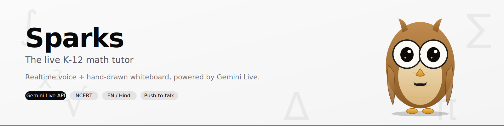
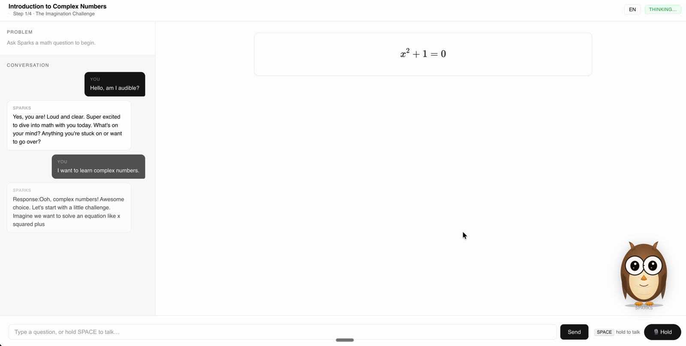
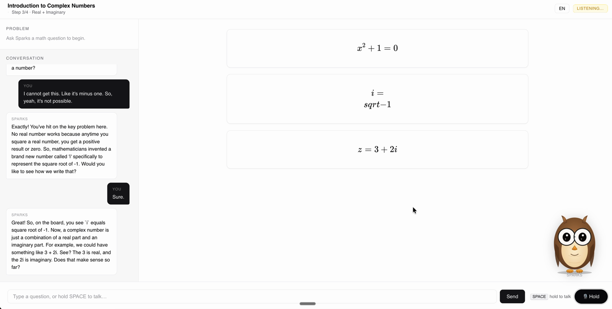
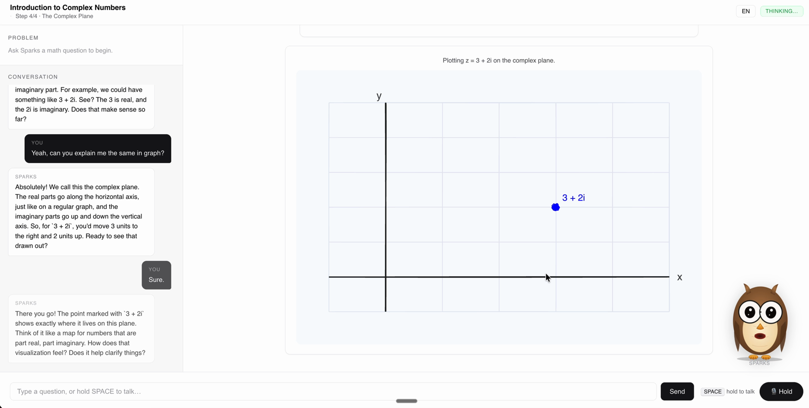
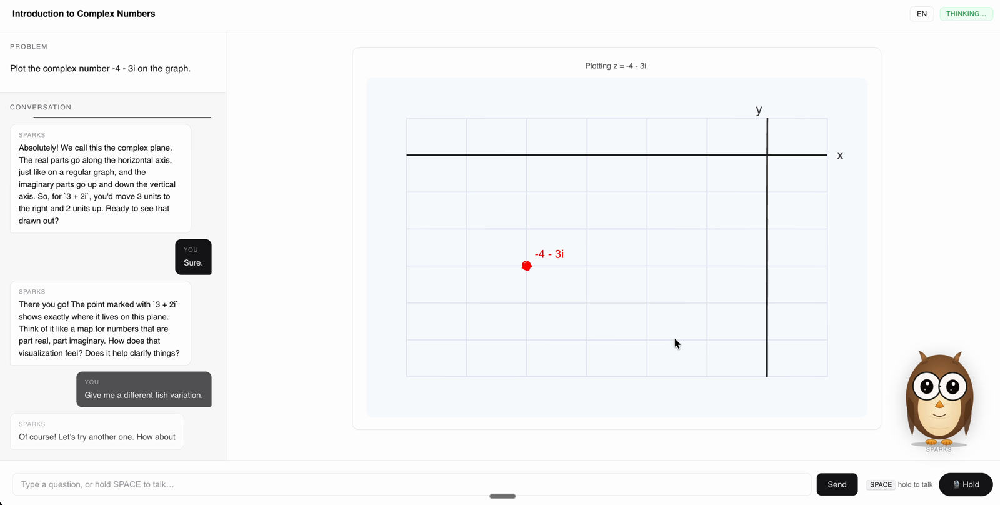
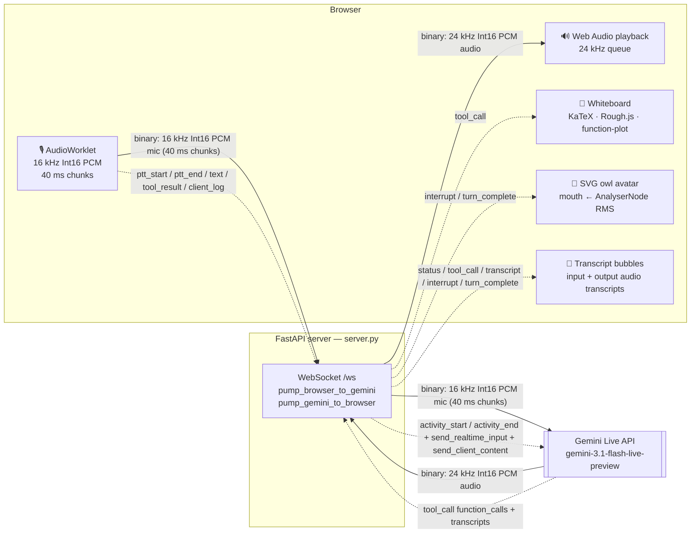

<p align="center">
  
</p>

<h1 align="center">Sparks — Realtime voice K-12 math tutor</h1>

<p align="center">
  <strong>Gemini Live API voice tutor for K-12 NCERT math — Hindi / English, hand-drawn whiteboard, open source.</strong>
</p>

<p align="center">
  Hold <kbd>SPACE</kbd>, ask a math question, and Sparks talks back in real audio while drawing equations, geometric proofs, and function plots on a whiteboard. No STT/TTS pipeline. Native audio in, native audio out.
</p>

<p align="center">
  <a href="https://www.python.org/downloads/"></a>
  <a href="https://ai.google.dev/gemini-api/docs/live"></a>
  <a href="https://fastapi.tiangolo.com/"></a>
  <a href="LICENSE"></a>
  
  
</p>

<p align="center">
  <a href="#-quick-start"><strong>Try it in under a minute →</strong></a>
  &nbsp;·&nbsp;
  <a href="#-architecture">Architecture</a>
  &nbsp;·&nbsp;
  <a href="#-whiteboard-tools-sparks-can-call">Whiteboard tools</a>
  &nbsp;·&nbsp;
  <a href="CLAUDE.md">For AI agents</a>
</p>

---

## 🎬 Demo

<p align="center">
  <video src="https://github.com/thegauravmahto/sparks-ai-math-tutor/raw/feat/readme-revamp/static/assets/demo.mp4" controls width="100%" title="45-second Sparks demo — complex numbers lesson"></video>
</p>

| | |
|---|---|
|  |  |
|  |  |

---

## ✨ What is Sparks?

Sparks is a realtime voice tutor that lives in your browser. You hold <kbd>SPACE</kbd>, ask a math question in English or Hindi, and Sparks answers out loud while simultaneously drawing equations, diagrams, and function plots on a shared whiteboard. No videos, no pre-recorded answers — every response is generated live.

Indian classrooms have specific needs. Sparks is aligned to the NCERT/CBSE curriculum for Classes 6–10 (ages 11–16). It code-switches naturally between Hindi and English ("Chalo, ek example dekhte hain…"), uses rupees (₹), kilometres, and lakhs in word problems, and structures every solution in the Indian classroom format: **Given → To Find → Solution → Answer**. Local names — Ravi, Priya, Anjali — appear in examples by default.

Under the hood, Sparks uses no separate speech-to-text or text-to-speech layer. The browser streams raw 16 kHz PCM mic audio to the Gemini Live API, which returns 24 kHz audio and structured tool calls (function calls from the model that the browser dispatches as DOM updates) in the same stream. The whiteboard reacts as Sparks speaks — KaTeX renders the equation, Rough.js sketches the geometry, and the owl avatar lip-syncs to the audio amplitude.

---

## 🚀 Features

- 🎙️ **Native voice in / out** — 16 kHz Int16 PCM mic input, 24 kHz Int16 PCM Gemini audio output. No WebRTC, no third-party STT or TTS.
- 🔘 **Push-to-talk + manual VAD** — hold <kbd>SPACE</kbd> (or the on-screen Hold button) to talk; `activity_start` / `activity_end` markers gate each turn.
- 📐 **16 whiteboard tools** — 7 layout/state tools, 6 high-level diagram templates (triangle, coordinate plane, unit circle, parabola, number line, equation), and 3 primitives.
- 📚 **NCERT/CBSE-aligned** — tuned for Classes 6–10 with Indian problem formats, unit conventions, and bilingual examples.
- 🌐 **EN / Hindi code-switching** — Sparks picks the blend automatically; you can also pin the language via the pill in the header.
- 📝 **Live captions** — `input_audio_transcription` and `output_audio_transcription` stream both sides of the conversation in real time.
- 🦉 **Lip-synced owl avatar** — hand-drawn SVG owl with large round glasses, ear tufts, and talon feet; mouth driven by audio RMS via `AnalyserNode`; eyes track the mouse; blinking idle animation.
- ✏️ **Hand-drawn math** — Rough.js gives every geometric diagram a pencil-sketch aesthetic; KaTeX renders crisp LaTeX equations; function-plot.js handles 2D plots.
- 📦 **Zero npm / build step on the frontend** — KaTeX, function-plot.js, and Rough.js are loaded from CDN. Open `index.html` and it just works.
- 🐍 **Single-file Python backend** — `server.py` is the entire FastAPI bridge. Four pip packages, no database, no queue.

---

## ⚡ Quick start

Get running in under a minute:

```bash
git clone https://github.com/thegauravmahto/sparks-ai-math-tutor.git
cd sparks-ai-math-tutor
pip install -r requirements.txt
cp .env.example .env           # paste your GEMINI_API_KEY into .env
python server.py               # serves http://127.0.0.1:8765
```

Open <http://127.0.0.1:8765>, hold <kbd>SPACE</kbd>, ask a math question.

Get your `GEMINI_API_KEY` from [Google AI Studio](https://aistudio.google.com/apikey) — it's free to start.

For chunk-level audio and event traces, run with `LOG_LEVEL=DEBUG`:

```bash
LOG_LEVEL=DEBUG python server.py
```

---

## 🏛️ Architecture



`server.py` is a thin relay: the browser streams raw 16 kHz Int16 PCM from an AudioWorklet over a binary WebSocket frame, the server forwards it to the Gemini Live API via `send_realtime_input`, and Gemini's 24 kHz PCM audio response flows back the same path in reverse. A parallel JSON channel carries tool calls that drive KaTeX, Rough.js, and function-plot renderers on the whiteboard.

While the server is running, open <http://127.0.0.1:8765/architecture> for a colour-coded inline-SVG diagram of the same data flow.

---

## 🛠️ Tech stack

### AI

| Component | Detail |
|-----------|--------|
| Model | `gemini-3.1-flash-live-preview` |
| SDK | `google-genai >= 1.0.0` |

### Backend

| Component | Version |
|-----------|---------|
| Python | 3.11+ |
| FastAPI | >= 0.110 |
| Uvicorn | >= 0.28 (standard extras) |
| python-dotenv | >= 1.0 |
| Transport | WebSocket (binary + JSON text frames) |

### Frontend

| Component | Notes |
|-----------|-------|
| HTML5 / CSS3 / JavaScript | No build step, no framework |
| AudioWorklet (`pcm-worklet.js`) | Float32 → Int16 16 kHz, 40 ms chunks |
| Web Audio API | `AudioContext` + `AnalyserNode` (fftSize 512) for RMS mouth animation |
| WebSocket | Binary PCM + JSON control frames |

### Math rendering (CDN — pinned versions)

| Library | Version | Purpose |
|---------|---------|---------|
| KaTeX | **0.16.11** | LaTeX equation rendering |
| function-plot.js | **1.25.1** | 2D function plots |
| Rough.js | **4.6.6** | Hand-drawn geometric sketches |

---

## 📐 Whiteboard tools Sparks can call

16 tools total, in three categories.

<details>
<summary><strong>Layout / state (7 tools)</strong></summary>

| Tool | Purpose |
|------|---------|
| `set_topic(title)` | Update the header banner text |
| `set_problem(text, latex?, grade?)` | Pin the problem statement in the left panel |
| `set_step(current, total, title?)` | Update the step tracker (e.g., "Step 3/5 · Solve for x") |
| `set_language("en"\|"hi")` | Update the language indicator pill |
| `clear_board()` | Wipe the whiteboard and reset the step tracker |
| `focus(label)` | Elevate one card to "current focus"; previous focus dims |
| `highlight(label)` | Flash any card for ~1.6 s to draw attention |

</details>

<details>
<summary><strong>High-level diagram templates (6 tools)</strong></summary>

| Tool | Purpose |
|------|---------|
| `write_equation(latex, label)` | Render a KaTeX equation card on the whiteboard |
| `draw_triangle(sideA, sideB, sideC, rightAngleAt?, vertexLabels?, sideLabels?)` | SSS-derived triangle, hand-drawn via Rough.js, with optional right-angle marker |
| `draw_coordinate_plane(xMin, xMax, yMin, yMax, points?, lines?, functions?)` | 2D plane with gridlines, labeled axes, points, line segments, and function overlays |
| `draw_unit_circle(angleDegrees?, showSinCos?)` | Unit circle with optional angle arc and sine/cosine projection segments |
| `draw_parabola(a, b?, c?, showRoots?, showVertex?)` | Plot y = a·x² + b·x + c with auto-annotated roots and vertex |
| `draw_number_line(min, max, marks?, highlights?)` | Number line with ticks, optional point marks, and shaded intervals |

</details>

<details>
<summary><strong>Primitives / escape hatches (3 tools)</strong></summary>

| Tool | Purpose |
|------|---------|
| `plot_function(expression, xMin, xMax, yMin, yMax, annotations?)` | Generic 2D function plot using math.js expression syntax |
| `draw_shapes(shapes, width?, height?)` | Freeform geometry canvas — supports `line`, `circle`, `polygon`, `point`, `text`, `arrow` |
| `draw_svg(svg)` | Raw SVG markup injection — sanitised, keep under 3 KB |

Prefer the high-level templates. Use `draw_shapes` as a fallback and `draw_svg` as a last resort.

</details>

---

## 🔌 WebSocket protocol

Both directions share one WebSocket, mixing binary PCM frames with JSON text frames.

<details>
<summary><strong>Browser → Server</strong></summary>

| Type | Payload | Purpose |
|------|---------|---------|
| *binary* | 16 kHz / 16-bit mono PCM (40 ms chunks) | Mic audio stream |
| `ptt_start` | (none) | Server sends `ActivityStart()` to Gemini |
| `ptt_end` | (none) | Server sends `ActivityEnd()`, logs stats |
| `text` | `{text: string}` | Typed turn, forwarded via `send_client_content` |
| `tool_result` | `{id: string, ok: boolean}` | Browser ack for a completed tool call |
| `client_log` | `{level: "info"\|"warn"\|"error", msg: string}` | Relays browser console to the Python terminal as `[browser] …` |

</details>

<details>
<summary><strong>Server → Browser</strong></summary>

| Type | Payload | Purpose |
|------|---------|---------|
| *binary* | 24 kHz / 16-bit mono PCM | Gemini audio for playback |
| `status` | `{text: string}` | Status pill in the header |
| `tool_call` | `{id, name, args}` | Forwarded Gemini function call to dispatch on the whiteboard |
| `transcript` | `{role: "user"\|"assistant", text, final}` | Live caption chunks for the conversation panel |
| `interrupt` | (none) | Gemini was interrupted — flush playback, dim avatar, close transcript bubbles |
| `turn_complete` | (none) | Turn finished — stop avatar talking animation, close transcript bubbles |

</details>

---

## ⚙️ Configuration

Two environment variables. Both are read from `.env` in the repo root (or a parent directory).

| Variable | Required | Default | Purpose |
|----------|----------|---------|---------|
| `GEMINI_API_KEY` | **yes** | — | Google AI Studio API key; authenticated to `google-genai` client |
| `LOG_LEVEL` | no | `INFO` | Python logging level for uvicorn and the `livetutor` logger |

Copy `.env.example` to `.env` and fill in your key. `LOG_LEVEL=DEBUG` adds chunk-level audio and event traces.

---

## 🐛 Known quirks

- **Session duration** — Gemini Live sessions cap at ~10–15 min and emit a `GoAway` close (error 1008). Reload the tab to start a fresh session. This is expected behaviour, not a bug.
- **First reload after CSS edits** — Browsers cache aggressively. Use <kbd>Cmd</kbd>+<kbd>Shift</kbd>+<kbd>R</kbd> (or <kbd>Ctrl</kbd>+<kbd>Shift</kbd>+<kbd>R</kbd>) to force a fresh fetch. You will spend 20 minutes debugging code that already works if you skip this.
- **ASGI race on tab close** — If the tab closes mid-turn, you'll occasionally see `Unexpected ASGI message 'websocket.send' after close` in the server log. Harmless — the next session opens cleanly.
- **STEM only** — The system prompt is tuned for K-12 NCERT math. Out-of-domain topics (programming, history) respond verbally but the 16 whiteboard tools won't find a natural fit.

---

## 🗺️ Roadmap

- [ ] **🆘 `help wanted`** Real viseme-based lip-sync — drop a Ready Player Me `.glb` or Rive `.riv` file and wire up Three.js + `TalkingHead.js` or `@rive-app/canvas`. Amplitude-only is the current placeholder.
- [ ] **🆘 `help wanted`** Subject expansion — physics force diagrams, biology cell labels, chemistry bond diagrams, electric-circuit primitives.
- [ ] **🆘 `help wanted`** More language pills — Telugu, Tamil, Kannada, Marathi, Bengali, Gujarati.
- [ ] Annotation overlay system — `annotate(target_label, at, text)` to draw arrows and callouts onto existing diagrams in math coordinates.
- [ ] Auto-reconnect on Gemini Live `GoAway` instead of requiring a tab reload.

---

## 🤝 Contributing

For human contributors: keep the dependency footprint minimal. The frontend loads KaTeX, function-plot.js, and Rough.js from CDN — please don't introduce an npm build step. The backend uses four pip packages. When adding a new whiteboard tool, prefer a high-level template over a raw primitive; templates give the model better semantics and students better-looking output. Don't introduce dark-theme styles — the white theme is an explicit design choice.

For AI agents working in this repo: read [`CLAUDE.md`](CLAUDE.md) before touching code. It documents the manual-VAD rationale (and why you must not revert to auto-VAD), the three-place lockstep change required for every new whiteboard tool (`TOOLS` array + `SYSTEM_PROMPT` + `dispatchTool` switch), Gemini Live session gotchas, and the browser-console relay pattern that lets you debug without DevTools access.

---

## 🙏 Acknowledgements

- [Google AI / Gemini](https://ai.google.dev/) — Gemini Live API for native voice in/out
- [KaTeX](https://katex.org/) — fast, accurate LaTeX rendering in the browser
- [Rough.js](https://roughjs.com/) — the hand-drawn aesthetic that makes diagrams feel like a teacher sketching on a blackboard
- [function-plot.js](https://mauriciopoppe.github.io/function-plot/) — 2D function plotting with minimal setup
- [shadcn/ui](https://ui.shadcn.com/) — design token conventions that inspired the white zinc theme

---

## 📄 License

[MIT](LICENSE) © 2026 Gaurav Mahto.

---

<sub>This project is an open-source Gemini Live API reference implementation designed for K-12 NCERT math in Indian classrooms. Unlike pipeline-based systems, it streams native voice in and out through the Gemini Live API — no separate STT or TTS layer — using an AudioWorklet for low-latency PCM capture and a FastAPI WebSocket backend. Students and teachers who speak Hindi or need Hindi/English code-switching are first-class users. The hand-drawn whiteboard renders equations with KaTeX and sketches geometry with Rough.js, making voice AI feel tactile and classroom-ready.</sub>
